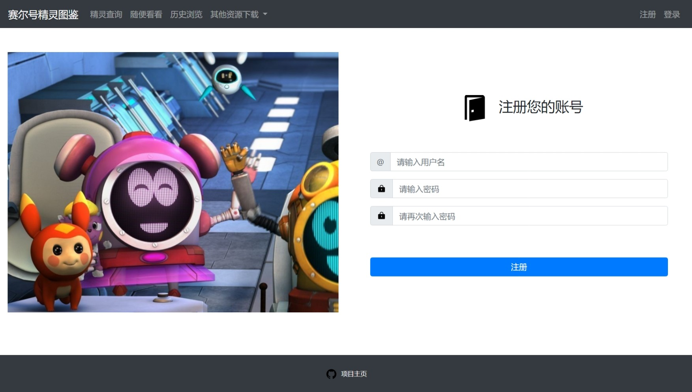
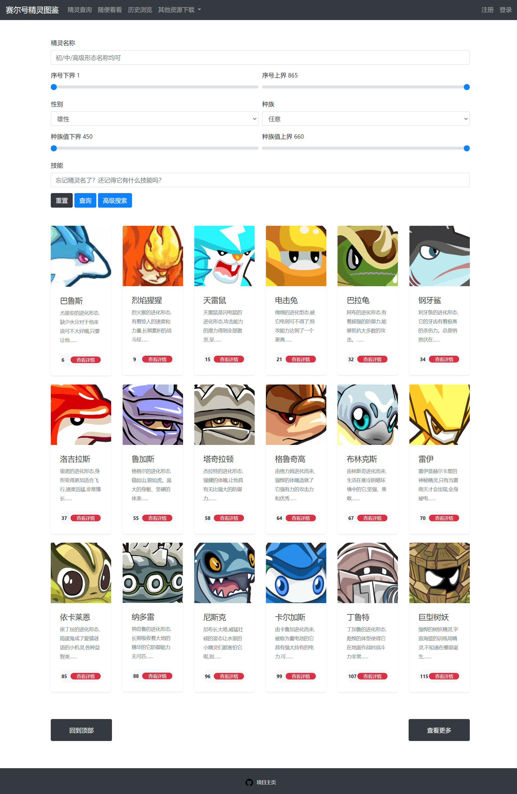
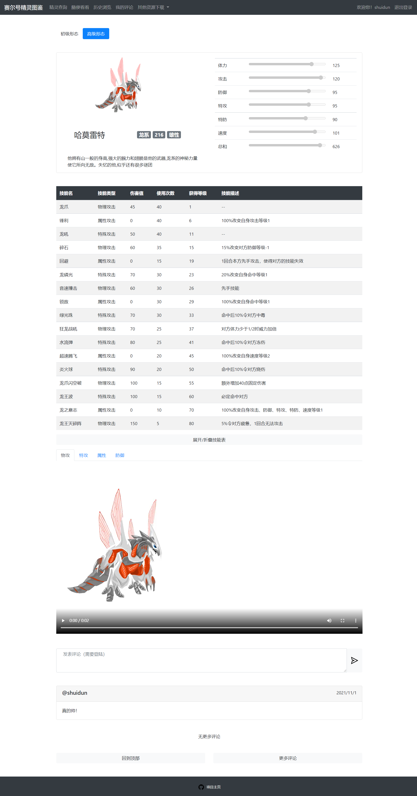

# seer

赛尔号精灵图鉴网站

## 如何部署

* `apt install git-lfs && git lfs install`
* `git clone https://github.com/shui-dun/seer`
* 根据`application.template.yml`编写`application.yml`
* 根据`docker-compose.template.yml`编写`docker-compose.yml`
* `docker-compose up -d`

## 功能

* 搜索精灵
* 查看精灵信息
* 查看历史浏览
* 评论（需要登陆）

## 前端

前端没有使用框架，只使用了bootstrap UI库和原生JS

## 后端

后端使用了spring boot框架，另外使用了以下依赖：

* mybatis（持久化）
* shiro（权限控制）
* swagger（接口文档与测试）

## 截图

### 主页

### 注册界面

### 搜索精灵

### 精灵信息

